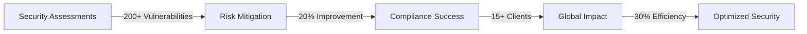

<div align="center">

# 🛡️ Shubham Kumar Sahu

### Cybersecurity Consultant | Ph.D. Researcher @ IIT Bhilai | CEH Master | Security Analyst


[](https://github.com/sksdbest)
[](https://www.linkedin.com/in/sksdbest/)
[](http://www.goodhacker.in)
[](mailto:shubham@goodhacker.in)

</div>

---

## 👨‍💻 About Me

```python
class ShubhamKumarSahu:
    def __init__(self):
        self.role = "Cybersecurity Consultant & Ph.D. Researcher"
        self.institution = "IIT Bhilai"
        self.location = "Durg, Chhattisgarh, India"
        self.experience = "5+ years"
        self.specialization = [
            "Penetration Testing",
            "Vulnerability Assessment",
            "DevSecOps Integration",
            "GRC & Compliance",
            "Incident Response"
        ]
        self.current_focus = "Advanced Cyber Security Research"
        
    def get_expertise(self):
        return {
            "clients_served": "15+ international clients",
            "vulnerabilities_found": "200+ critical vulnerabilities",
            "compliance_improvement": "20% audit score increase",
            "scan_optimization": "30% false positive reduction"
        }
```

🔐 **Cybersecurity Consultant** at Central Business Solutions Inc. with proven expertise in securing enterprise systems, leading penetration testing engagements, and ensuring compliance with international security frameworks (ISO 27001, SOC 1/2, HIPAA, GDPR).

🎓 Currently pursuing **Ph.D. in Cyber Security** at IIT Bhilai, contributing to cutting-edge research in security domains.

📚 **Published Researcher** with multiple international publications on DDoS mitigation, cloud security, and emerging technologies.

---

## 🎯 Current Focus

- 🔬 **Research**: Advanced threat detection and mitigation strategies at IIT Bhilai
- 💼 **Consulting**: Delivering security solutions for global clients across diverse industries
- 🛠️ **Projects**: [CEH Practical Notes](https://github.com/sksdbest/CEH-Practical-Notes-) - Comprehensive guide for ethical hackers
- 🌱 **Learning**: Advanced API Security, Cloud Native Security, AI/ML in Cybersecurity
- 🤝 **Collaboration**: Open to security tool development and research partnerships

---

## 🛠️ Technical Arsenal

### 🔍 Security Testing & Assessment
```yaml
Methodologies:
  - Penetration Testing (VAPT)
  - Threat Modeling & Risk Assessment
  - Security Code Review
  - Red Team Operations
  
Techniques:
  - SAST (Static Application Security Testing)
  - DAST (Dynamic Application Security Testing)
  - IAST (Interactive Application Security Testing)
  - SCA (Software Composition Analysis)
```

### ⚔️ Offensive Security Tools


**Enterprise Tools**: Nessus | OpenVAS | HCL AppScan | Acunetix | Nikto | Checkmarx | BlackDuck | Qualys

### 🔐 Security Domains
- **Application Security**: Web, Mobile, API Security Testing
- **Network Security**: Intrusion Detection, Traffic Analysis, Firewall Configuration
- **Cloud Security**: AWS, Azure, GCP Security Assessment
- **DevSecOps**: CI/CD Pipeline Security, Container Security
- **Incident Response**: SIEM (Splunk, QRadar, Sumo Logic), Forensics
- **Compliance & GRC**: ISO 27001, SOC 1/2, HIPAA, GDPR, PCI-DSS

### 💻 Programming & Scripting


### 🔧 DevSecOps & Infrastructure


### 🌐 Web Technologies


---

## 🏆 Certifications & Achievements

<div align="center">

### 🎖️ Professional Certifications

| Certification | Issuing Organization | Year |
|--------------|---------------------|------|
| 🔴 **Certified Ethical Hacker (CEH Master)** | EC-Council | 2022 |
| 🔵 **Certified Ethical Hacker (CEH Practical)** | EC-Council | 2020 |
| 🟢 **EC-Council Certified Security Analyst (ECSA)** | EC-Council | 2026 |
| 🟡 **API Security Certified Associate** | Wallarm | 2026 |
| 🟠 **BlackDuck SCA Analyst** | BlackDuck | 2025 |
| ⚫ **Cybersecurity Career Mentor** | EC-Council | - |
| 🔷 **IBM Cloud Essentials** | IBM | - |

[📜 View All Certifications](https://www.linkedin.com/in/sksdbest/details/certifications/)

</div>

---

## 💼 Professional Experience Highlights

### 🎯 Cyber Security Consultant
**Central Business Solutions Inc.** | *Nov 2022 - Present*

```diff
+ Reduced vulnerability scan false positives by 30% through intelligent tool integration
+ Led penetration testing for 15+ international clients across various industries
+ Uncovered and reported 200+ critical vulnerabilities, preventing potential breaches
+ Improved compliance audit scores by 20% through strategic security controls
+ Implemented Zero Trust architecture and DevSecOps workflows for enterprise clients
+ Expertise in GRC: ISO 27001, SOC 1/2, HIPAA compliance management
```

**Key Achievements:**
- 🌍 International client portfolio spanning multiple compliance frameworks
- 📊 Streamlined incident response with 40% reduction in log analysis time
- 🔒 Successfully integrated HCL AppScan, BlackDuck, and Acunetix into DevSecOps pipelines
- 📝 Contributed to business development through RFP filings and client acquisition

### 🔬 Research & Innovation
**Ph.D. Candidate** | *IIT Bhilai* | *2023 - 2028*

Conducting advanced research in cybersecurity, focusing on:
- Threat detection and mitigation strategies
- Cloud security architectures
- AI/ML applications in security

---

## 📚 Research Publications

1. **DDoS Attacks & Mitigation Techniques in Cloud Computing**  
   *GEDRAG & ORGANISATIE Review* (2020)

2. **Survey on Web-based Operating System**  
   *JETIR* (2019)

3. **Survey on Cryptocurrency Technology**  
   *IJAMTES* (2018)

4. **Parts of Speech Tagging for Chhattisgarhi Language**  
   *IJCRT* (2018)

5. **Hindi to Chhattisgarhi Translator**  
   *IJCRT* (2018)

---

## 📊 GitHub Statistics

<div align="center">


</div>

---

## 🎓 Education

```
🎓 Ph.D. in Computer Science & Engineering (Cyber Security)
   IIT Bhilai | 2023 - 2028 (Pursuing)

🎓 M.Tech in Cyber Forensics & Information Security (Honors)
   CSVTU, Bhilai | 2018 - 2021

🎓 Diploma in Cyber Law
   Government Law College, Mumbai | 2018

🎓 B.E. in Information Technology
   CSVTU, Bhilai | 2014 - 2018
```

---

## 🌟 Featured Projects

### 🔐 [CEH Practical Notes](https://github.com/sksdbest/CEH-Practical-Notes-)
Comprehensive guide and notes for Certified Ethical Hacker (Practical) certification
- Hands-on penetration testing scenarios
- Tool usage guides and techniques
- Real-world security assessment methodologies

---

## 🌐 Connect With Me

<div align="center">

[](https://linkedin.com/in/sksdbest)
[](https://twitter.com/sksdbest)
[](https://fb.com/sksdbest)
[](https://instagram.com/sksdbest)
[](https://medium.com/@sksdbest)
[](https://www.youtube.com/c/learnwithsahuji)
[](http://www.goodhacker.in)
[](mailto:shubham@goodhacker.in)

</div>

---

## 💡 Areas of Expertise

<div align="center">

| Security Domain | Expertise Level | Key Skills |
|----------------|-----------------|------------|
| 🎯 Penetration Testing | ⭐⭐⭐⭐⭐ | Web, Mobile, Network, API Testing |
| 🔍 Vulnerability Assessment | ⭐⭐⭐⭐⭐ | VAPT, Threat Modeling, Risk Analysis |
| ⚙️ DevSecOps | ⭐⭐⭐⭐ | CI/CD Security, Container Security |
| 📋 GRC & Compliance | ⭐⭐⭐⭐⭐ | ISO 27001, SOC 1/2, HIPAA, GDPR |
| ☁️ Cloud Security | ⭐⭐⭐⭐ | AWS, Azure, GCP Security |
| 🚨 Incident Response | ⭐⭐⭐⭐ | SIEM, Forensics, Threat Hunting |

</div>

---

## 🏅 Leadership & Recognition

- 🏆 **Winner** - Model Competition, INSPIRE DST Camp (2013)
- 🎖️ **Internship Camp** - INSPIRE DST (2014)
- 🥈 **Semi-finalist** - IT Olympiad (2015)
- 📜 **NSS B & C Certificate Holder** (2015-2018)
- 👨‍🏫 **Founder** - Inspire Academy (200+ students, 2015-2017)

---

## 📈 Professional Impact

<div align="center">



</div>

---

## 💬 Security Philosophy

> *"Security is not a product, but a process. It's about creating layers of defense, staying ahead of threats, and fostering a culture where security is everyone's responsibility."*

---

## 🤝 Open to Collaboration

I'm actively seeking collaboration opportunities in:
- 🔧 **Security Tool Development** - Open-source security tools and frameworks
- 🔬 **Research Projects** - Academic research in cybersecurity domains
- 📚 **Knowledge Sharing** - Writing technical blogs, tutorials, and guides
- 🎓 **Mentorship** - Helping aspiring security professionals

---

## ☕ Support My Work

If you find my projects, research, or content valuable:

<div align="center">

[](https://www.buymeacoffee.com/sksdbest)

</div>

---

<div align="center">

### 🔒 "Hack The Planet Responsibly" 🔒


**© 2024 Shubham Kumar Sahu | Cybersecurity Consultant & Researcher**


</div>

